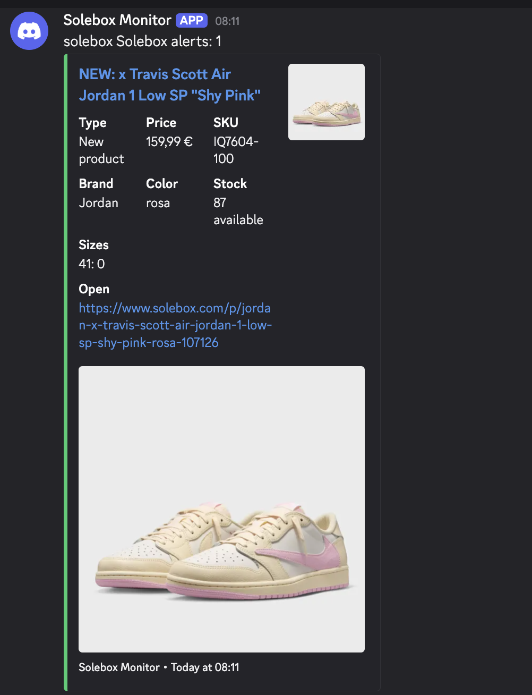

# Solebox Monitor

Fast Go monitor for Solebox product launches, restocks, and exact stock changes.

It watches Solebox's live product surfaces, enriches discovered products through the `products/many` endpoint, persists stock snapshots locally, and sends Discord embeds with product links, images, SKU, price, brand, color, total stock, and per-size stock.

## Live Catch

On May 30, 2026 at 08:11 CEST, this monitor successfully caught the Solebox release of `x Travis Scott Air Jordan 1 Low SP "Shy Pink"` as a new product alert, including image, product URL, SKU, price, and stock data.



## Features

- Live new-product discovery from Solebox's `Neu` category.
- Release-page discovery from `/de-de/s/releases`, including cards that appear before normal product discovery.
- Product enrichment through `products/many` for exact stock and size-level stock.
- Restock alerts when products move from sold out to in stock.
- Stock-change alerts for total stock and size-stock changes.
- Discord webhook embeds with product image, link, metadata, stock, and sizes.
- No private bearer token required for Solebox DE; the public `X-Charybdis` context is generated automatically.
- Local JSON state to avoid duplicate alerts.
- Lock file protection so two monitor instances cannot write the same state file.

## Quick Start

```bash
cp .env.example .env
```

Edit `.env` and set your Discord webhook:

```bash
DISCORD_WEBHOOK_URL=https://discord.com/api/webhooks/...
```

Run directly:

```bash
go run .
```

Or build and run:

```bash
go build -o solebox-monitor .
./solebox-monitor
```

## Recommended Config

The default `.env.example` is configured for Solebox DE live discovery:

```env
PRODUCTS_MANY_URL=https://api.solebox.com/sni-pl-prd-stor-we-char/v1/v1/products/many
DISCOVERY_CATEGORY_URLS=https://api.solebox.com/sni-pl-prd-stor-we-char/v1/v1/categories/2773
RELEASE_PAGE_URLS=https://www.solebox.com/de-de/s/releases
DISCOVERY_PAGES=1
DISCOVERY_PER_PAGE=48
POLL_INTERVAL=10s
ALERT_STOCK_DELTA=0
RESULT_BASE_URL=https://www.solebox.com
```

`ALERT_STOCK_DELTA=0` alerts on every stock or size-stock change. Set a higher value if you only want larger stock increases.

## State And First Run

The first successful run seeds `seen.json` and does not alert for products that already exist. Later polls compare current product snapshots against the saved state.

`seen.json` stores:

- Product ID and key.
- Product URL and image URL.
- Title, SKU, brand, color, price, and retail price.
- In-stock status, total stock, and per-size stock.
- Stock fingerprint used for change detection.

## Environment

Required:

- `DISCORD_WEBHOOK_URL`

Usually keep these defaults:

- `PRODUCTS_MANY_URL`
- `DISCOVERY_CATEGORY_URLS`
- `RELEASE_PAGE_URLS`
- `RESULT_BASE_URL`

Useful options:

- `POLL_INTERVAL`: polling interval, minimum `5s`.
- `DRY_RUN=true`: fetch and update local state without posting Discord alerts.
- `RUN_ONCE=true`: perform one poll and exit.
- `DISCORD_MENTION`: role or user mention for alert batches.
- `PRODUCT_IDS`: optional comma-separated IDs for exact products you want to track directly.
- `LOCK_FILE`: prevents duplicate monitor instances.

Optional overrides:

- `AUTHORIZATION_BEARER`
- `X_CHARYBDIS`
- `REFERER`
- `USER_AGENT`

For normal Solebox DE monitoring, `AUTHORIZATION_BEARER` and `X_CHARYBDIS` can stay empty.

## Requirements

- Go 1.22 or newer.
- A Discord webhook URL.

## License

MIT
